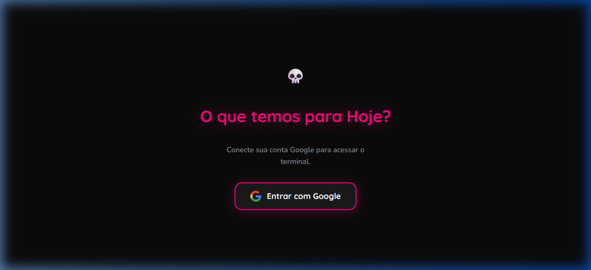
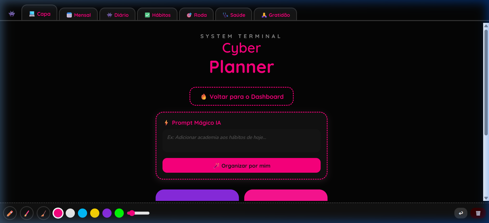

<div align="center">

# 💀 Cyber Dashboard & Planner

### ⚡ Painel de Controle Pessoal — Tema Hacker Dark Mode

Um workspace pessoal completo com **Dashboard inteligente** e **Planner digital**, totalmente integrado com Google (Gmail, Calendar) e IA generativa (Gemini). Construído com estética **Hacker Dark Mode** com detalhes em rosa neon.





</div>

---

## 🔥 Funcionalidades

### 📊 Dashboard (Morning Dashboard)
- 🔐 **Login com Google** — Autenticação segura via Google Identity Services
- 📧 **Emails do Gmail** — Veja seus emails mais recentes sem sair do painel
- 📅 **Agenda do Google Calendar** — Próximos compromissos do dia
- 🌤️ **Previsão do Tempo** — Clima em tempo real da sua cidade
- 📈 **Gráfico de Produtividade** — Visualize seu desempenho semanal
- 🔔 **Notificações de Reunião** — Alertas automáticos para compromissos próximos

### 📓 Cyber Planner
- 📆 **Calendário Mensal** — Visualize e anote compromissos no mês
- 📝 **Diário com Tarefas** — Checklist diário com emojis de humor (😢🙂😁🤩🥳)
- ✅ **Rastreador de Hábitos** — Acompanhe hábitos diários com marcação visual
- 🎯 **Roda da Vida** — Avalie 8 áreas da sua vida em um gráfico radar
- 🩺 **Saúde** — Registre consultas, exames e observações médicas
- 🙏 **Diário de Gratidão** — Escreva o que você mais amou no seu dia
- 🖊️ **Desenho Livre** — Desenhe, marque e anote à mão livre em cada página
- 🤖 **Prompt Mágico IA** — Use a Gemini AI para organizar tarefas por texto livre

---

## 🛠️ Tecnologias

| Tecnologia | Uso |
|---|---|
| **HTML5 / CSS3 / JS** | Frontend completo sem frameworks |
| **Google Identity Services** | Autenticação OAuth 2.0 |
| **Gmail API** | Leitura de emails |
| **Google Calendar API** | Leitura de agenda |
| **Gemini AI (Google)** | Processamento de linguagem natural |
| **Chart.js** | Gráficos de produtividade e roda da vida |
| **LocalStorage** | Persistência de dados 100% local e privada |

---

## 🎨 Design

- **Tema:** Dark Mode Hacker com detalhes em Rosa Neon (#FF007F)
- **Fontes:** Nunito + Quicksand (Google Fonts)
- **Estilo:** Glassmorphism, bordas tracejadas, efeitos neon glow
- **Paleta de Cores:**

| Cor | Hex | Uso |
|---|---|---|
| 🖤 Deep Black | `#0B0B0B` | Fundo principal |
| ⬛ Dark Card | `#1A1A1A` | Cards e painéis |
| 💗 Neon Pink | `#FF007F` | Destaques e acentos |
| 💜 Cyber Purple | `#8A2BE2` | Detalhes secundários |
| 💚 Terminal Green | `#00FF00` | Indicadores de sucesso |
| 💛 Hacker Gold | `#FFD700` | Alertas e avisos |

---

## 🚀 Como Usar

### Pré-requisitos
- Um navegador moderno (Chrome, Edge, Firefox)
- Conta Google (para integração com Gmail e Calendar)

### Rodando Localmente
```bash
# Clone o repositório
git clone https://github.com/Ana40/meu-dashboard.git

# Entre na pasta
cd meu-dashboard

# Inicie um servidor local (precisa do Node.js)
npx http-server -p 8080 -c-1

# Acesse no navegador
# http://localhost:8080/
```

### Usando no GitHub Pages
Basta acessar: **[https://ana40.github.io/meu-dashboard/](https://ana40.github.io/meu-dashboard/)**

---

## 🔒 Privacidade & Segurança

- ✅ **Dados 100% locais** — Tudo é salvo no `localStorage` do seu navegador
- ✅ **Sem banco de dados externo** — Nenhuma informação pessoal sai do seu computador
- ✅ **Chaves de API seguras** — A chave do Gemini é armazenada apenas no seu navegador
- ✅ **Código aberto** — Todo o código é transparente e auditável

---

## 👩‍💻 Autora

**Ana Carla** — Desenvolvedora Salesforce

---

<div align="center">

Feito com 💗 e muito ☕ | Tema Hacker Dark Mode 💀

</div>
